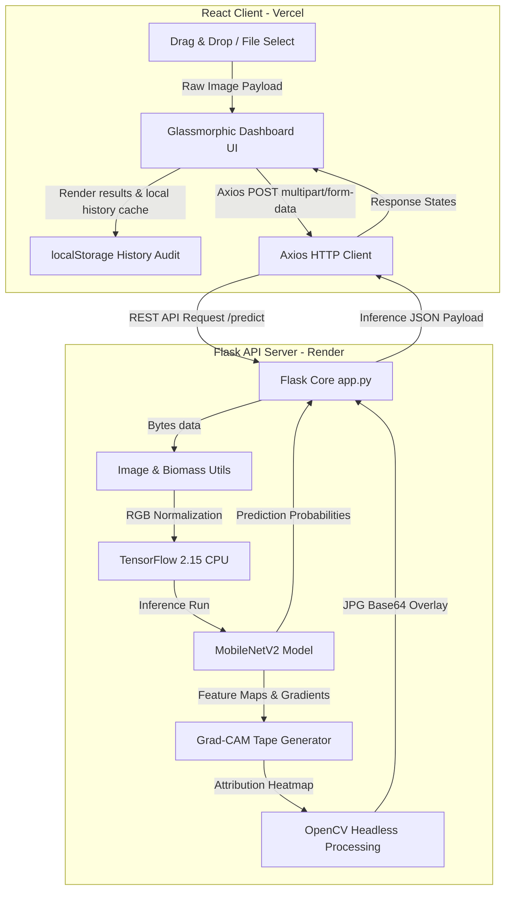

# 🌲 EarthSense AI - Deforestation Detection Dashboard

> Real-Time Satellite Biomass & Deforestation Analytics Powered by Deep Learning

EarthSense AI is an award-winning, production-ready satellite imagery analysis platform. It leverages a transfer-learned **MobileNetV2** model to diagnose deforestation patterns, estimate vegetation density heuristics, and display explainable Grad-CAM heatmaps.

---

## 📖 Table of Contents
1. [Problem Statement & Solution](#-problem-statement--solution)
2. [Platform Architecture](#%EF%B8%8F-platform-architecture)
3. [Key Features](#-key-features)
4. [Tech Stack](#-tech-stack)
5. [Directory Layout](#-directory-layout)
6. [Local Environment Setup](#%EF%B8%8F-local-environment-setup)
7. [Production Deployment Guide](#-production-deployment-guide)
8. [API Specifications](#-api-specifications)
9. [Future Scope](#-future-scope)
10. [License & Acknowledgments](#-license--acknowledgments)

---

## 🚨 Problem Statement & Solution

### The Challenge
Deforestation accounts for nearly 10% of global greenhouse gas emissions. Traditional methods of forest cover analysis rely on manually audited surveys, slow regional reports, or expensive proprietary satellite pipelines. Without immediate, automated, and explainable tooling, environmental protection agencies cannot react swiftly to illegal logging or changing forest canopy health.

### The EarthSense AI Solution
EarthSense AI offers a zero-overhead web platform that ingests raw satellite imagery frames and provides:
1. **Instant Deep Inference:** A MobileNetV2 neural network classifies frames as **Deforested** vs. **Healthy Forest** with high confidence.
2. **Biomass Heuristics:** Pixel-level analytics extract greenness vegetation indexes (`g > r + 10` & `g > b + 10` & `g > 60`) and normalized intensity values.
3. **Model Explainability (Grad-CAM):** Grad-CAM heatmaps highlight exactly which pixels drove the model's classification, ensuring transparency and trust.
4. **PDF Reports & Session Audits:** Auto-generated PDF diagnostic reports and persistent local history sidebars.

---

## 🗺️ Platform Architecture

The diagram below details the data flow from client upload to neural inference, explainability generation, and client-side rendering.



---

## ✨ Key Features

*   **Single-Frame Diagnostics:** Drag and drop any top-down satellite image to receive instant forest health diagnostics.
*   **Grad-CAM Heatmaps:** Overlay explainable attention layers showing where the model detected vegetation loss or intact canopies.
*   **Parallel Batch Inference:** Upload dozens of image tiles simultaneously to run parallel diagnostics with instant aggregate summaries and pie-chart distributions.
*   **Report Compilation:** Download styled Environmental Analysis Reports directly as PDFs with automated client-side window print formatting.
*   **Persistent Dashboard Audits:** An automated local sidebar caches your last 10 predictions in `localStorage`. Clicking any history item restores the full telemetry in the main workspace.
*   **Cold-Start and Memory Optimizations:** Backend optimized with thread-limiting variables (`intra/inter_op_parallelism`) and compile-free Keras model loading to operate comfortably within a 512MB RAM free tier.

---

## 🛠️ Tech Stack

### Frontend Client
*   **Core:** React 19.2 (Functional Components & Hooks)
*   **Build System:** Vite 7.2 (Production Bundler)
*   **HTTP Layer:** Axios 1.13 & Native Fetch
*   **Charting:** ChartJS 4.5 & React-ChartJS-2 5.3 (Pie distributions)
*   **Styling:** Vanilla CSS (Glassmorphism layout, print targets, custom keyframe loaders)

### Backend Service
*   **Framework:** Flask 3.0 & Gunicorn (WSGI Server)
*   **Inference Engine:** TensorFlow-CPU 2.15.0 & Keras
*   **Image Processing:** OpenCV Headless 4.9.0 & Pillow (PIL)
*   **Environment:** Python 3.10

---

## 📂 Directory Layout

```
earthsense/
├── backend/
│   ├── model/
│   │   ├── class_indices.json        # Class index map (deforested vs. non-deforested)
│   │   └── deforestation_model.h5    # Pre-trained MobileNetV2 model (11.5 MB)
│   ├── app.py                        # Flask API & Grad-CAM endpoints
│   ├── utils.py                      # Preprocessing & green-ratio calculation
│   ├── requirements.txt              # Backend packages (pinned for production)
│   ├── runtime.txt                   # Render Python version target
│   ├── Procfile                      # Web service startup parameters
│   └── Dockerfile                    # Containerization configuration (optional)
├── frontend/
│   ├── public/                       # Static public assets
│   ├── src/
│   │   ├── assets/                   # SVG Icons & images
│   │   ├── components/
│   │   │   ├── BatchUpload.jsx       # Multi-file analyzer & pie chart
│   │   │   └── UploadCard.jsx        # Single-file drag-drop & report tool
│   │   ├── App.css                   # Responsive glassmorphism stylesheet
│   │   ├── App.jsx                   # Main layout shell & localStorage manager
│   │   ├── api.jsx                   # Axios API request endpoints
│   │   └── main.jsx                  # React DOM anchor
│   ├── package.json                  # Frontend packages & compile scripts
│   └── vite.config.js                # Vite asset path mapping
├── DEPLOYMENT.md                     # Deployment options documentation
└── README.md                         # Main documentation catalog
```

---

## 🛠️ Local Environment Setup

### 1. Backend Startup
1. Move to the backend folder:
   ```bash
   cd backend
   ```
2. Create and activate a Python virtual environment:
   ```bash
   python -m venv .venv
   # Windows PowerShell
   .venv\Scripts\Activate.ps1
   # Linux / macOS
   source .venv/bin/activate
   ```
3. Install production requirements:
   ```bash
   pip install -r requirements.txt
   ```
4. Run the development server:
   ```bash
   python app.py
   ```
   *The backend will boot up locally at `http://localhost:5000`.*

### 2. Frontend Startup
1. Open a new terminal and move to the frontend folder:
   ```bash
   cd frontend
   ```
2. Install Node dependencies:
   ```bash
   npm install
   ```
3. Set the development base URL (already defaults to `http://localhost:5000` inside `App.jsx`/`api.jsx`). If you need to override it, create a `.env` file:
   ```env
   VITE_API_BASE=http://localhost:5000
   ```
4. Boot the Vite development ecosystem:
   ```bash
   npm run dev
   ```
   *Open `http://localhost:5173` in your browser.*

---

## 🚀 Production Deployment Guide

### Backend Deploy (Render)
1. Register on [Render.com](https://render.com) and link your GitHub account.
2. Select **"Create Web Service"** and select `EarthSense-AI-V2`.
3. Set the following settings:
    *   **Root Directory:** `backend`
    *   **Runtime:** `Python 3`
    *   **Build Command:** `pip install -r requirements.txt`
    *   **Start Command:** `gunicorn app:app --workers 1 --threads 4 --bind 0.0.0.0:$PORT`
4. In the **Environment Variables** panel, insert:
    *   `PORT` = `5000`
    *   `MODEL_FILE` = `model/deforestation_model.h5`
    *   `FLASK_ENV` = `production`
5. Click **Deploy**. Copy the endpoint URL (e.g. `https://earthsense-backend.onrender.com`).

### Frontend Deploy (Vercel)
1. Register on [Vercel.com](https://vercel.com).
2. Click **"Add New..."** ➡️ **"Project"** and import `EarthSense-AI-V2`.
3. Configure settings:
    *   **Root Directory:** `frontend`
    *   **Framework Preset:** `Vite`
4. Add the following **Environment Variable**:
    *   **Key:** `VITE_API_BASE`
    *   **Value:** `https://earthsense-backend.onrender.com` *(Use your active Render URL, no trailing slash)*
5. Click **Deploy**.

---

## 🔌 API Specifications

### 1. Ping Health Check
*   **Path:** `/ping`
*   **Method:** `GET`
*   **Response:**
    ```json
    { "status": "ok" }
    ```

### 2. Single-Frame Diagnostic (With Grad-CAM)
*   **Path:** `/predict`
*   **Method:** `POST`
*   **Payload Format:** `multipart/form-data`
*   **Parameters:** `image` (binary file)
*   **Response:**
    ```json
    {
      "label": "Deforested",
      "confidence": 98.423,
      "prob_deforested": 0.9842,
      "prob_non_deforested": 0.0158,
      "veg_fraction": 0.1245,
      "veg_norm": 0.0487,
      "gradcam_base64": "/9j/4AAQSkZJRgABAQA...",
      "timings": {
        "total": 0.485,
        "predict": 0.112,
        "gradcam": 0.324
      }
    }
    ```

### 3. Parallel Batch Diagnostics
*   **Path:** `/batch_predict`
*   **Method:** `POST`
*   **Payload Format:** `multipart/form-data`
*   **Parameters:** `images` (binary file array)
*   **Response:**
    ```json
    {
      "summary": {
        "total": 2,
        "deforested": 1,
        "not_deforested": 1
      },
      "results": [
        {
          "filename": "tile_01.png",
          "label": "Deforested",
          "confidence": 0.9842,
          "prob_deforested": 0.9842,
          "prob_non_deforested": 0.0158,
          "veg_fraction": 0.1245
        },
        {
          "filename": "tile_02.png",
          "label": "Not Deforested",
          "confidence": 0.9412,
          "prob_deforested": 0.0588,
          "prob_non_deforested": 0.9412,
          "veg_fraction": 0.7412
        }
      ]
    }
    ```

---

## 🔮 Future Scope

1.  **Multi-Spectral Bands:** Integrate Sentinel-2 multi-spectral data (specifically red-edge and shortwave infrared bands) to calculate Normalized Difference Vegetation Index (NDVI) values directly, bypassing basic RGB masks.
2.  **Temporal Tracking:** Add a historic slider to show forest loss trends over a 5-year timeline for a specific latitude/longitude block.
3.  **Hazard Models:** Scale the pipeline to classify adjacent environmental hazards, including active wildfire detection hotspots and mudslide-risk zones.

---

## 📄 License & Acknowledgments

*   **License:** Distributed under the MIT License.
*   **Model Source:** MobileNetV2 base weights trained on the ImageNet dataset. Fine-tuning datasets compiled from public satellite deforestation frames.
*   **Contributors:** [Ansuj Meher](https://github.com/ANSUJKMEHER)
